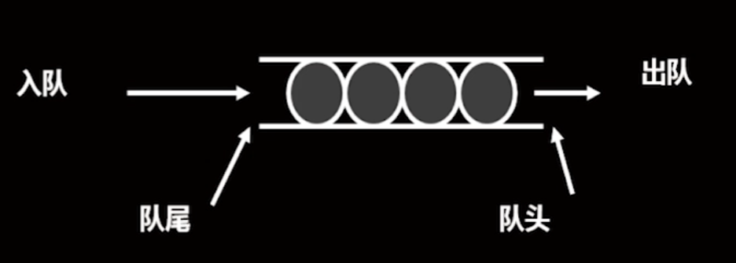

# 类与动态内存分配

## 静态数据成员
1. 定义：整个类所有类共享的变量
2. 声明：成员前加保留词static
3. 说明： 
   1. 静态数据成员不属于对象的一部分，而是类的一部分；
   2. 定义对象时并不为静态成员分配空间
4. 实现：静态成员的定义一般出现在类的实现文件
5. 引用：通过作用域操作符直接调用或从对象引用它
   ```C++
   class::rate | obj.rate
   ```
## 静态成员函数
1. 定义：专门处理静态数据成员，不能处理其他数据成员的函数
2. 声明：在类定义中的函数原型前加保留词static
3. 说明：
   1. 静态成员函数没有this指针
   2. 静态成员函数可以在不定义对象的情况下进行调用
4. 调用：通过作用域操作符直接调用或从对象引用它

## 队列
1. 定义：一种特殊的线性表，插入在表尾，删除在表头
2. 图示：
3. 队列类
   1. 类型属性：可以储存一系列项，队列中的项目数有一定限制
   2. 类型操作：初始化队列为空；确定队列为空；确定队列已满；确定队列中的项数；在队列末尾添加项；
              删除队列开头项；清空队列

## 类的继承
1. 定义：在一个（单继承）或多个（多继承）已有类的基础上，扩展属性或方法，形成一个更强大的类
2. 基类 <- 派生类 : 公有派生；保护派生；私有派生
3. 单继承格式
   ```C++
   class derived_class: inherited_method base_class{}
   #include <iostream>
   #include <string>
   
   // base_class
   class Book {
   protected:
   std::string title;
   std::string author;
   
   public:
   Book(const std::string &title, const std::string &author)
   : title(title), author(author) {}
   
       virtual void display() const {
           std::cout << "Book: \"" << title << "\" by " << author << std::endl;
       }
   
       virtual ~Book() {} // 虚析构函数，确保正确的析构派生类对象
   };
   // inherited_class
   class AudioBook : public Book {
   private:
   std::string narrator;
   
   public:
   AudioBook(const std::string &title, const std::string &author, const std::string &narrator)
   : Book(title, author), narrator(narrator) {}
   
       void display() const override {
           std::cout << "Audio Book: \"" << title << "\" by " << author;
           std::cout << ", narrated by " << narrator << std::endl;
       }
   };
   ```